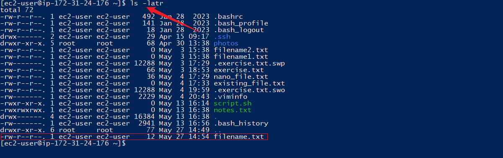

# Advanced Linux Commands
Linux Distribution: AWS Linux 
Primarily derived from fedora and centOS linux
## Role of hyphen in permission
If a permission is not defined, it is represented by hyphen i.e hyphen means absent of perrmsission

## Task One: chmod Command
chmod command is used to modify file or directory permission for a user, group and others. Below steps demostrate chmod command in action.
### Step 1: create new file using touch command
NB: Touch command is used to create new file or update the timestamp of existing file.

### Step 2: Check the permission details for the file using ls -latr 

### Step 3: Modify the permission using chmmod +x to include execute permission for all user group.

### Step 4: Modify the permission using chmod with numeric values to assign different permission level for each user group.
For example: chmod 755 means read, write and execute for user, read and execute for group and others.

### Step 5: create another file using touch command
### Step 6: chmod 700 to modify the persmission

### Step 7: ls -latr to confirm permission for user only

## Task Two: chown command
chown command is used to change the ownership of a file or directory for a user or group.

### Step 1: confirm initial ownership of filename.txt using ls-latr

### Step 2: change the ownership of filename.txt from ec2-user to jeleel and all users in  jeleel group usin chown jeleel:jeleel and use ls -latr to confirm

## Task Three: Superuser Privilledges
Superuser privilleges is used to perform some sensitive administrative task,because it is not advisable to login as superuser always, the best method to add sudo(super user do) before every command that requires administrative privilleges.
### Step 1: sudo -i to login as root user

## Task Four: User Management in Linux
### Step 1 : Create new user using adduser
Note: This command requires sudo before it because it is an administrative command.

### Step 2: Grant administrative privillege to the new user using sudo usermod -aG wheel johndoe

### Step 3: Login as new user johndoe using su johndoe and cd /home/johndoe

### Step 4: Changing user password using sudo passwd johndoe

### Step 5: Login with the johndoe user with the new password

### Step 6: Creating group using sudo groupadd developers
Note: Group is an abstract collection of users with similar role and task.

### Step 7: Adding user to the created group using usermod command

### Step 8: Verify group membership using id johndoe

### Step 9: Deleting a user using userdel johndoe and confirm deletion using id johndoe

## Task Five: Grant  group ownership of a directory.
ownership of a directory or file can be granted to a user or group using chown command.

### Step 1: Grant developer group ownership of to directory

### Step 2:Grant Read/Write permission to the group

## Task Six: User and Group management
### Step 1: Create group named devops using groupadd command, create 5 users and add each user to the devops group

### Step 2: Create /home directory for each user (Mary, mohammed, ravi, tunji, sofia)

### Step 3: Add Mary, Mohammed, ravi, Tunji and Sofia to devops group

